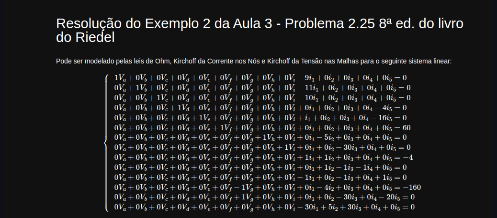

# Circuitos-Eletricos

<p align="center">

</p>
<p align="center">
<em>Imagem 1: Sistema Linear utilizado. </em>
</p>

```Importação do Numpy para rodar o código```
   
    1. pip install sympy
    2. from sympy import *
    3. import numpy as np
    4. import pandas as pd

